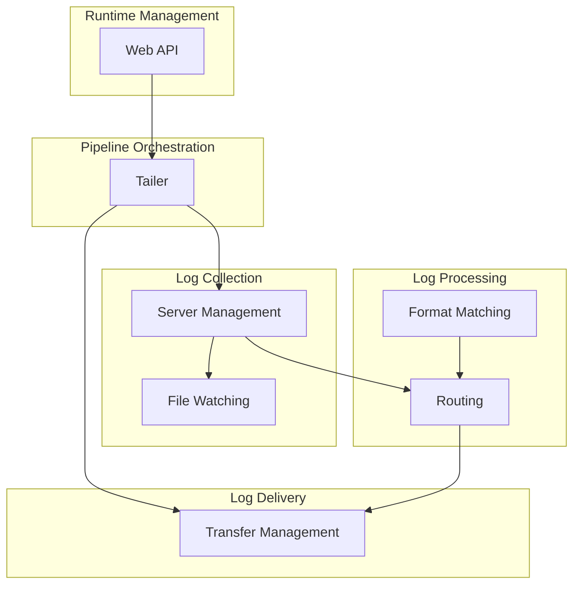

# Product Architecture

## Product Overview
logtail is a log tailing and aggregation utility that collects logs from multiple sources, filters them using pattern matching, and routes matched logs to various destinations.

## Business Modules

### Log Collection
- **Description**: Manages log sources and produces raw log data

#### Server Management
- **Responsibilities**: Manage log source lifecycle, spawn and monitor workers
- **Features**:
  - Single command execution and output tailing
  - Multiple parallel command execution
  - Dynamic command generation (e.g., Kubernetes pod discovery)
  - File and directory watching with filtering (prefix, suffix, recursive)
  - Manual data input via API
- **Related Models**: Server, Worker
- **Related Processes**: Log Collection, Server Lifecycle

#### File Watching
- **Responsibilities**: Monitor filesystem for log file changes
- **Features**:
  - OS-event-based or timer-based file change detection
  - Filename filtering by prefix and suffix
  - Recursive directory monitoring
  - Automatic worker creation for new files
  - Inactivity-based worker cleanup (1 hour idle, 24 hour silence)
  - Directory file count limiting
- **Related Models**: Server (file mode), Worker

### Log Processing
- **Description**: Filters and routes log data through configurable pipelines

#### Routing
- **Responsibilities**: Buffer, filter, and dispatch log records to destinations
- **Features**:
  - Configurable channel buffer size
  - Blocking or non-blocking mode on buffer full
  - Drop counting for observability
  - Multi-matcher AND-logic filtering
  - Multi-destination dispatch
- **Related Models**: Router, Matcher
- **Related Processes**: Data Pipeline

#### Format Matching
- **Responsibilities**: Identify log record boundaries in multi-line output
- **Features**:
  - Wildcard-based prefix pattern matching
  - Custom wildcard syntax: `?`=any byte, `~`=alpha, `!`=digit
  - Multi-line log record grouping
- **Related Models**: Format

### Log Delivery
- **Description**: Sends filtered logs to various destinations

#### Transfer Management
- **Responsibilities**: Deliver log data to configured destinations
- **Features**:
  - Console output (stdout)
  - Rotating file output (8MB per file)
  - HTTP webhook POST with connection pooling
  - DingTalk bot messaging with rate limiting
  - Lark/Feishu bot messaging with rate limiting
  - Batch aggregation for webhook destinations
  - Transfer statistics counting
- **Related Models**: Transfer (Console, File, Webhook, DingTalk, Lark), Batcher
- **Related Processes**: Data Pipeline

### Pipeline Orchestration
- **Description**: Coordinates the overall log tailing pipeline lifecycle

#### Tailer
- **Responsibilities**: Own and manage all servers, transfers, and their lifecycles
- **Features**:
  - Unified startup and shutdown
  - Dynamic addition/removal of servers, routers, and transfers
  - Pipeline statistics collection
  - Configuration persistence
- **Related Models**: Tailer
- **Related Processes**: Startup, Server Lifecycle

### Runtime Management
- **Description**: Provides runtime configuration and monitoring capabilities

#### Web API
- **Responsibilities**: Expose HTTP endpoints for management and monitoring
- **Features**:
  - Server list and management UI
  - WebSocket real-time log streaming
  - CRUD operations for servers, routers, and transfers
  - Pipeline statistics endpoint
- **Related Models**: (uses Tailer API)
- **Related Processes**: Runtime Management

## Business Module Relationship Diagram

