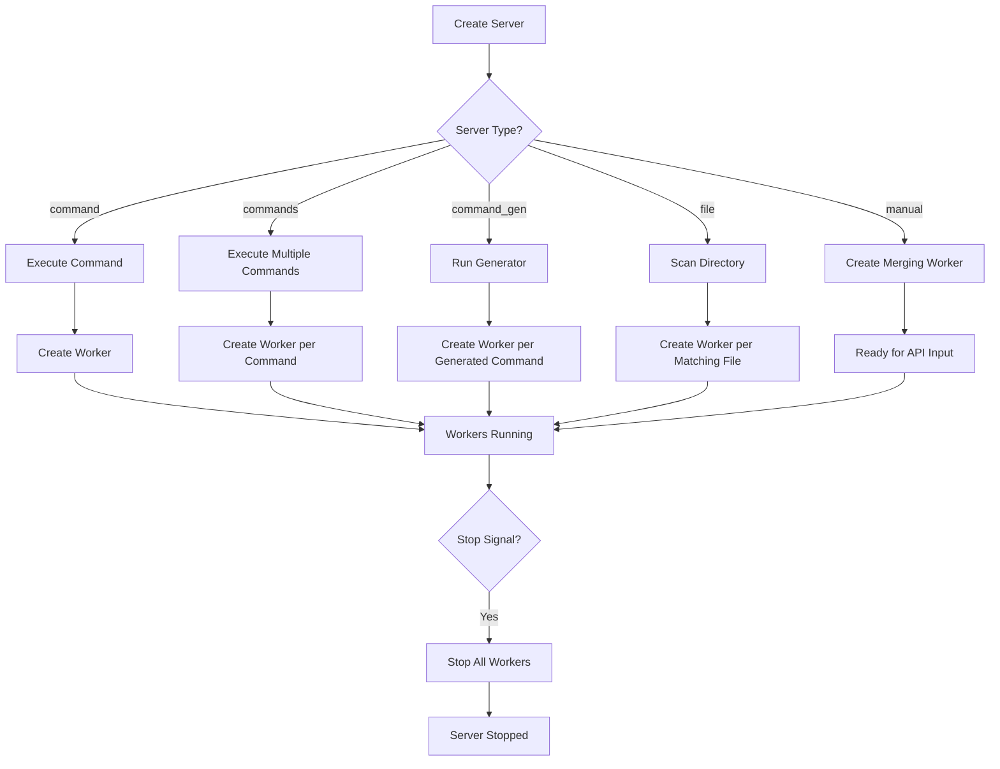

# Server Lifecycle

## Overview
Manages the complete lifecycle of a log source server, including worker spawning based on server type and dynamic worker management.

## Participating Roles

| Role | Responsibilities |
|------|------------------|
| Operator | Configures servers via config file or API |
| System | Manages server and worker lifecycle |

## Process Steps

### Step 1: Server Creation
- **Executing Role**: System
- **Description**: Create server instance from configuration
- **Input**: ServerConfig
- **Output**: Server in Created state
- **Model State Changes**: Server → Created

### Step 2: Worker Spawning (varies by type)
- **Executing Role**: System
- **Description**: Create workers based on server type
- **Input**: Server type and configuration
- **Output**: Running workers

#### For Single Command
- Execute the shell command, create one worker tailing its output

#### For Multiple Commands
- Parse newline-separated commands, create one worker per command

#### For Command Generator
- Execute the generator command
- Parse its output as a list of commands
- Create one worker per generated command
- Periodically re-run generator; if output changes, stop old workers and create new ones

#### For File/Directory Watch
- Scan directory for matching files (apply prefix/suffix filters)
- Create one worker per matching file (using `tail -f` with retry)
- Set up filesystem watcher for new/deleted files
- Automatically create workers for new files, stop workers for deleted files

#### For Manual Input
- Create only the merging worker (accepts API writes)

### Step 3: Runtime Management
- **Executing Role**: Operator via API
- **Description**: Add or remove servers at runtime
- **Input**: Server configuration or server name
- **Output**: Server added/removed
- **Model State Changes**: Server → Running or Server → Stopped

### Step 4: Server Shutdown
- **Executing Role**: System
- **Description**: Stop all workers and release resources
- **Input**: Stop signal
- **Output**: Server in Stopped state
- **Model State Changes**: All Workers → Stopped, Server → Stopped

## Business Rules

| Rule ID | Rule Name | Rule Description | Applicable Scenario |
|---------|-----------|------------------|---------------------|
| SRV-01 | Mutual exclusion | Only one of command, commands, command_gen, file may be set | Step 1 |
| SRV-02 | File inactivity | Workers for files with no reads for 1 hour are stopped | Step 2 (file mode) |
| SRV-03 | File silence | Workers for files with no activity for 24 hours are stopped | Step 2 (file mode) |
| SRV-04 | API restriction | Only file-watch servers can be added via API | Step 3 |
| SRV-05 | Command retry | Dynamic workers retry on failure after 10 seconds | Step 2 |

## Exception Handling
- **Command execution failure**: Worker enters Failed state; retries for dynamic workers
- **File not found**: Worker stopped; filesystem watcher continues monitoring
- **Directory permission denied**: Server startup fails with error

## Flowchart

