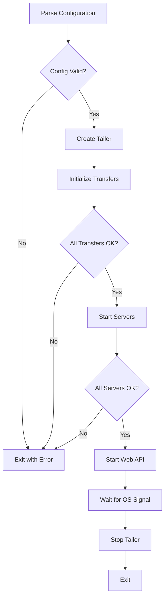

# Startup

## Overview
System initialization process that parses configuration, creates the tailer, starts all components, and enters the main event loop.

## Participating Roles

| Role | Responsibilities |
|------|------------------|
| Operator | Provides configuration via file or CLI flags |

## Process Steps

### Step 1: Configuration Parsing
- **Executing Role**: System
- **Description**: Parse configuration from JSON/YAML file or CLI flags
- **Input**: Config file path (`-file`), or CLI flags (`-cmd`, `-port`, `-match-contains`, etc.)
- **Output**: Validated Config model
- **Model State Changes**: Config created

### Step 2: Tailer Creation
- **Executing Role**: System
- **Description**: Create tailer instance with parsed configuration
- **Input**: Config
- **Output**: Tailer in Created state
- **Model State Changes**: Tailer → Created

### Step 3: Transfer Initialization
- **Executing Role**: System
- **Description**: Initialize all configured transfer destinations
- **Input**: Transfer configurations from Config
- **Output**: Active transfer instances
- **Model State Changes**: Each Transfer → Active

### Step 4: Server Startup
- **Executing Role**: System
- **Description**: Create and start all configured servers, spawning workers
- **Input**: Server configurations from Config
- **Output**: Active server instances with running workers
- **Model State Changes**: Each Server → Running, Tailer → Running

### Step 5: Web API Start
- **Executing Role**: System
- **Description**: Start HTTP server for management API and WebSocket streaming
- **Input**: Port number, Tailer instance
- **Output**: HTTP server listening
- **Model State Changes**: None (web API is stateless)

### Step 6: Signal Handling
- **Executing Role**: System
- **Description**: Wait for OS signals (SIGINT, SIGTERM, SIGHUP) to initiate shutdown
- **Input**: OS signal
- **Output**: Graceful shutdown initiated
- **Model State Changes**: Tailer → Stopped

## Business Rules

| Rule ID | Rule Name | Rule Description | Applicable Scenario |
|---------|-----------|------------------|---------------------|
| STR-01 | Config validation | Config must be validated before tailer creation | Step 1 |
| STR-02 | Transfer before server | Transfers must be initialized before servers start | Steps 3-4 |
| STR-03 | Graceful shutdown | All servers stopped before transfers on shutdown | Step 6 |

## Exception Handling
- **Invalid configuration**: System exits with error message
- **Transfer initialization failure**: System exits with error
- **Server startup failure**: System exits with error
- **Port already in use**: System exits with error

## Flowchart

