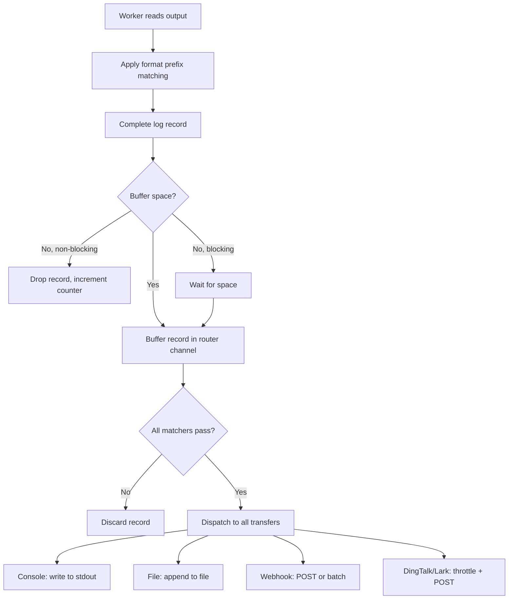

# Data Pipeline

## Overview
The core log data flow from source collection through filtering to destination delivery. This is the primary business process of logtail.

## Participating Roles

| Role | Responsibilities |
|------|------------------|
| System | Executes the pipeline automatically |

## Process Steps

### Step 1: Data Collection
- **Executing Role**: Worker
- **Description**: Read output from command or file
- **Input**: Raw bytes from command stdout or file changes
- **Output**: Raw log data
- **Model State Changes**: None

### Step 2: Log Record Formation
- **Executing Role**: Worker
- **Description**: Apply format prefix matching to identify log record boundaries
- **Input**: Raw log data, FormatConfig
- **Output**: Complete log records (possibly multi-line)
- **Model State Changes**: None

### Step 3: Router Buffering
- **Executing Role**: Router
- **Description**: Receive log record into buffered channel
- **Input**: Complete log record
- **Output**: Buffered record or dropped record
- **Model State Changes**: Drop count incremented if buffer full (non-blocking mode)

### Step 4: Matcher Filtering
- **Executing Role**: Router
- **Description**: Apply all matchers to the log record (AND logic)
- **Input**: Log record, list of Matchers
- **Output**: Pass (all matchers match) or Reject (any matcher fails)
- **Model State Changes**: None

### Step 5: Transfer Dispatch
- **Executing Role**: Router
- **Description**: Send matched record to all configured transfers
- **Input**: Matched log record, list of Transfers
- **Output**: Record delivered to each transfer
- **Model State Changes**: None

### Step 6: Destination Delivery
- **Executing Role**: Transfer
- **Description**: Deliver the record to the final destination
- **Input**: Log record with source identifier

#### Console Transfer
- Write to stdout

#### File Transfer
- Append to current output file; rotate at 8MB

#### Webhook Transfer
- If batching enabled: add to Batcher (flush on threshold or timeout)
- If batching disabled: POST directly to URL

#### DingTalk/Lark Transfer
- Check CAS throttle (5-second interval between messages)
- Check rate limiter (if configured); drop with warning if exceeded
- Format message with prefix and source
- Truncate to 1024 bytes
- POST to webhook URL

## Business Rules

| Rule ID | Rule Name | Rule Description | Applicable Scenario |
|---------|-----------|------------------|---------------------|
| PIP-01 | Multi-line grouping | Lines not matching format prefix are appended to current record | Step 2 |
| PIP-02 | AND matcher logic | All matchers must pass for a record to be dispatched | Step 4 |
| PIP-03 | Non-blocking default | Buffer overflow drops records silently with counter increment | Step 3 |
| PIP-04 | Broadcast dispatch | Matched records go to ALL configured transfers | Step 5 |
| PIP-05 | DingTalk/Lark throttle | At most one message per 5 seconds, with count summary | Step 6 |
| PIP-06 | Message truncation | DingTalk/Lark messages truncated to 1024 bytes | Step 6 |
| PIP-07 | Batch flush on stop | Pending batched records flushed during shutdown | Step 6 |

## Exception Handling
- **Buffer full (non-blocking)**: Record dropped, drop counter incremented
- **HTTP request failure**: Error logged, record lost (no retry)
- **Rate limit exceeded**: Record dropped with warning log
- **File write failure**: Error logged

## Flowchart

